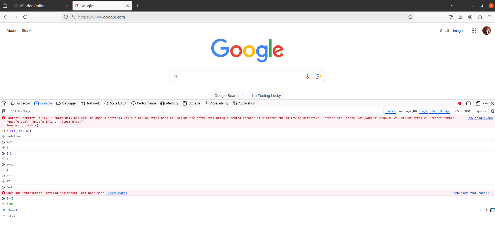
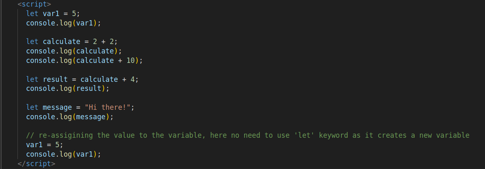
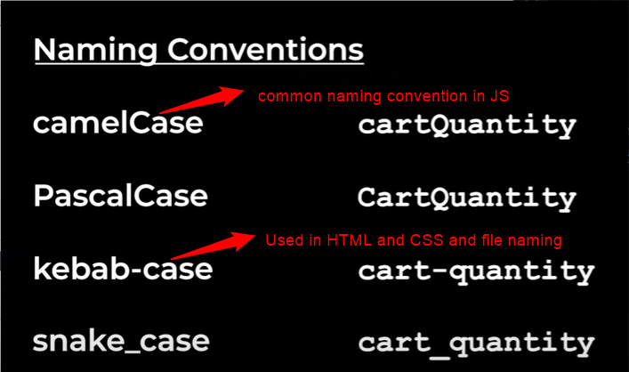
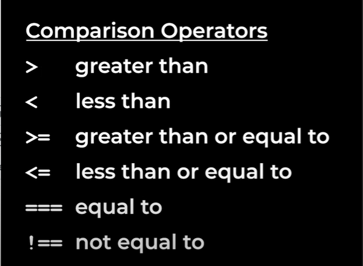

# JAVASCRIPT

JavaScript is a technology used to create dynamic websites.
So there are three technologies required to create a website

- HTML: creates the content of the website
- CSS: styling a website
- JS: makes the website interactive

---

## Basics:

Go to console in any web browser and perform this basic functions

- **alert**: alert('write anything'); hit enter, it will show the popup in the web browser.
- math: all math operations can be performed in console.



Another basic functionality to play with is just modify the content of the page through console i.e. type the command as it is

> document.body.innerHTML = 'hello';

The above command will change whole content of the page that is shown as temporary appearence.

Modifying the webpage is one of the most important featrures of javascript.

### Math order of operations

- \*, / are done first followed by +, -. Remember that \*, / has same priority and +, - have same priority.
- one more rule is, whatever that is present inside parenthesis is executed first.

#### Note

In programming languages, calculating floats will show the wiered behaviour of giving some garbage values also and it happens with some of the floats.

For rounding numbers use this functionality `Math.round('float number')`

## Strings

Bunch of characters that are enclosed inside quotes represents string.
ex: 'hello', 'hello world'

Strings can be combined by using concatenation operator i.e. '+', `'some'+'text' => 'sometext'`

#### Note

- To know the datatype of a particular value, use `typeof <content>` i.e. `typeof 1 => 'number'`, `typeof 'hello' => 'string'`
- In JS, upon concatenating string along with a number, it converts the number also into a string and concatenate it.

  ex: `'hello' + 2 => 'hello2'`

- JS always perform an operation form **left to right**. So if you try to do this `'$'+20.2323+456.123 => '$20.2323456.123'`, instead of adding the numbers it will concatenate into a single string. Becasue the 1st operation is to concatenate the string with number which results a string again.
- Strings also follow the order of precedence like numbers, which helps to overcome the above problem i.e. `'$'+(20.245+123.12)`, upon this it will perform the calculation 1st which is inside parenthesis and concatenation next.

Some of the complex examples to form a string => Items (2) = $28.94, this can be written as 'Items (' + (1+1) +'): $' + (2.95+799)/100

**String Interpolation** is a case where the values can be inserted directly by using `${}` => \`Items (${1+1}): $${2.95+799}/100` these type of strings are called **template strings**.

## Coding

Take a simple HTML file and in this to add the JS code use \<script> tags like `<script>write your code here</script>`

We can introduce the JS code to individual elements also by using attributes, suppose if u have a `<button>` element and to this add `onclick` attributed to that element like `onclick="<JS code>";`

### Comenting out the code

- `//` is used for commenting the code and used as single line comment.
- `/*<multi line comments>*/` is used for multi line commenting.

### console.log

Previously we are able to see some math operations and strings in console, so to do this in the code, use `console.log();` so now whatever is written inside this will be logged in console.

### Variables

Variable is like a container. We can save/store the value inside a variable and use it later. So now to create a variable => `let <variable name> = <variable value>;`, remember that we can use a variable whereever we use a value.



#### 3 Ways to create variables in JS

- let: `let <variable name> = <value>;`, if a variable value is changing use this.
- const: `const <cariable_name> = <value>;`, this value cannot be changed later on, the name itself means constant. Compiler raises TypeError if you try to change the value. This is used by default.
- var: `var <variable name> = <value>;`, this is actually the original way to create a variable and it can be changed later on. And this is used in old JS code.

#### Note

- `var` is not used because it doesn't follow the scope, i.e. in general scope means if we define a variable or anything inside a loop or inside an if statement, then that variable is particular ot that scope and it cannot be accessed outside. But if you create a variable using var and if the variable name is same, then it conflicts.

#### Variable name restrictions

- Variable names must not contain special word like let, console etc.
- Shoudn't start a variable name with a number, instead we can use the numbers in the middle or at the end.
- can't use special characters like `@%^&*` etc or a space in variables except `$ and _`.
- **camelCase** is the standard naming convention followed by JS and here are some more 

#### Note

- In JS, a semicolon `;` means end of that instruction.
- Better to use `const` instead of `let` when you are sure that variable is not going to change.

### Booleans

There are two boolean values `true`, `flase`.

Here are some of the comparision operators which results in Boolean values



#### Note

- `===` is used instead of `==` as `==` converts both the values into same type and gives the result which is not a good idea similarly with `!==` is used instead of `!=` to avoid the conversion behaviour.
- In the operator precedence, comparision operators have the lower priority than math.

### If Statements:

An If statement lets us write multiple groups of code and then decide which code to run.

#### Syantx

> if (condition) {\<statements>;}

A simple example is,

```
if (true){
  console.log('Hello');
}
```

It means that, if it is true then it logs Hello to the console. If it is false, then the code will not run.

```
if (false) {
  console.log('hello');
}
else {
  console.log('world');
}
```

In the above code snippet, the else part will be executed, as the if statement is false.

```
if (15>=16) {
  console.log('you can drive');
}
else if (15>=14){
  console.log('almost you are there);
}
else {
  console.log('you cant drive');
}
```

#### Note

- else statement is optional.
- Strategy in JS is to think what steps we need to do and convert them into code.

### Project-1: Rock-Paper-Scissors game

#### Steps:

- When we click a move, computer should randomly select a move.
- Compare the moves to get the result.
- Display the result in a popup.

All the above steps are called an `Algorithm`. Algorithm is a set of steps to complete a task or to solve a problem.

#### Flow:

- use `Math.random()` and store it in a variable. it gives the result between `0 and 1`.
- Now as there are 3 i.e. rock, paper, and scissors, divide the space between 0 and 1 into 3 equal parts.
- if the value is between 0 and 1/3 then its `rock`, if value is between 1/3 to 2/3 its `paper`, and 2/3 to 1 will be `scissors`.

### Truthy and Falsey values

If statements not only work with boolean values, instead they work with string, numbers etc.

```
if (5) {
  console.log('truthy value');
}
```

The above code snippet will work because it is true. But if the numebr is 0, then the it will not execute becuase 0 acts ike false.

> Falsey Values are `false, 0, '', NaN, undefined, null`. and any value which is not in this list is considered as truthy.

### Shortcuts for If statements

1. Terenary operator (?:): similar to if else statement. `<condition>?<if the statement is true this will execute>:<otherwise this will execute>`.

Example: `true? 'truthy':'falsey'` => so here the statement is true so 'truthy' will be executed.

2. Gaurd Operator (&&): same as the logical and, and if the 1st operant is false then it will not check for the second operand. it will result directly as false.

3. Default operator (||): similar to logical OR operator.

### Functions

A **function** lets you to reuse the code.

#### Syntax:

> `function <name of the function>() {<code>}`

```
function func1() {
  console.log('2+2');
  console.log('hello');
}

 func1(); // this is the function call or calling the function, so that it will execute.
 func1(); //again it calls the function.
```

#### Rules for writing a function:

- can't use the special words/keywords.
- can't start with a number.
- can't use special characters except $,\.
- for naming convention use camelCase.

In function there is `return` type. this is given at the end of the function to return the value when the fucntion is called.

Whatever the code that is written after the `return` statement is not executed because once the compiler comes to return statement it directly goes to the function call.

A Return statement gets out the value from the function where as a parameter puts in the value to the funciton.

#### functions with parameters

```
function calculateTax(para1) {
  console.log(para1 * 0.1);
}
calculateTax(2000); //this 2000 is called the argument to the function.
```

The rules are same as the fucntion rules for writing parameters.

### Objects

An Object groups multiple values together.

For example:

```
const product = {
  name: 'pavan'; // the left ones are called property and right ones are values.
  age: 25;
}
console.log(product) //displays all two values
console.log(product.name) //by using property you can access them individually
```

#### To update the values =>

```
product.name = 'pavan kumar';
product.age = 24;
console.log(product)
delete product.<property name> // this will delete the property
typeof product // it shows as object
```

Yet again object is just a value that is assigned to a variable. Objects make the code more organized.

There is another of accessing the properties in objects i.e. form the above example `product['age']` also gives the value of age here.

So now this `[]` notation is used when there is a situation arise like the dot notation will not work i.e. if there is property called `delivery-time` and if u try to access with dot notation it will not work as it treats '-' as a minus symbol, instead use square brackets notation.

More over in bracket notation we can use a string, a calculation or a variable which results in value.

#### nested objects

```
const product = {
  name: 'shoes',
  price: 2000,
  ratings: {
    'five-star': 2,
    'four-star': 3,
    'three-star': 2
  }
}
console.log(product['ratings']['four-star']) // this is the way to access nested objects
```

#### function in an object

As the function is also another type of value, it can also be placed inside of an object like below

```
const product = {
  name: 'shoes',
  price: 2000,
  ratings: {
    'five-star': 2,
    'four-star': 3,
    'three-star': 2
  }
  fun: function myShoes() {
    console.log('these are my shoes');
  }
}
```

#### Note

- When we save a `function inside of an object` it is called a `method` and we are already using the methods like console.log() i.e. console is the object that is provided by JS and log is placed inside of console. Similarly with Math.random(), it is also a function. So it says that `object+fucntion=method`.

### JSON(JavaScript Object Notation) - built-in

It is one of the built-in objects provided by JS. This object helps us to work with JSON. Basically it is a syntax. Its syntax is similar to objects but with less features.

The difference is all the properties must be enclosed in double quotes and will not support single quotes, and it doesn't support functions inside it.


We use JSON also even the javascript object is available, becasue this jsvascript object is only present in JS programming language but JSON is understood by almost every programming language.

#### JS object to JSON

The built-in JSON is used to convert JS object to JSON. we can do that by using `JSON.stringify(\<js object>)`,this actually results a string.

#### JSON to JS object

`JSON.parse(\<JSON>)` will convert the JSON to JS object.

### localStorage - built-in

localStorage is used to save the values more permanently, So far we are saving values in variables. But variables are temporary as they can only exist in the current page i.e. if we refresh the page or close the page the variables are deleted.

So previously in Rock-paper-scissors game we stored the values in variables and upon refreshing that page again the scores stasrt from 0, instead the situation should be like even if we refresh the page the scores should start from the place where we left until we hit the reset scores button. This is wehre localStorage comes into place.

localStorage only supports strings. localStorage will keep the items as it is even the page is refreshed.

#### Usage of localStorage:

`localStorage(<name>, <value you want to store>)` like `localStorage.setItem('message', 'Hello')` so here string 'Hello' is stored inside the local storage.

To get the string out of the localStorage => `localStorage.getItem('message')` => it gets the value that is stored in localStorage.

#### Note

- Whenever you need to pass string to localStorage.setItem() then if the string that is to passed is in object means, convert it into JSON format by using JSON.Stringify and pass it.

So in the project [!/home/xek2kor/Documents/Full_stack/Web-Development-and-Projects/Javascript/08-rock-paper-scissors.html](Rock-Paper-Scissors) this localStorage is implemented so that even after refreshing the page at any instant the scores will not be at the same number and continue from there.

So now modification needed is that upon clicking `reset scores` button we need to remove the scores from the local storage also.

### null vs undefined (Both are falsy values)

Both null and undefined will be representing something that doesn't have a value.

**null** - null is used to make intentionally something empty.

```
function func(param = default){
  console.log(param);
}

func(); => 'default'
func(undefined); => uses 'default' value
func(null); => it will not use default value, instead it gives null
```

### Auto-Boxing

Even strings have properties and methods like =>

```
console.log('hello'.length) => 5
console.log('hello'.toUpperCase()) => 'HELLO'
```

But as the above 'hello' is a string and how it has some methods, but only objects have properties. So there is a concept called `Auto-Boxing`.

So what happens here is, JS will automatically wraps the string into an object i.e. box. So that it can access above functions.

This auto-boxing also works on other values like numbers, booleans etc. But auto-boxing wil not work with null and undefined i.e. null.property, undefined.method() etc are not possible and returns error.

### Objects are references

```
      const obj1 = {
        message: 'hello';
      }
```

So now when the object is created, the actual value is created somewhere in the computers memory and the above variable `obj1` gets the reference that points to that locations memory. This is like a shortcut on the computer like, if u have chrome icon on taskbar but its original file location is different. Same here it works like that.

There is not way to see the reference but just know that it is a reference, actually is somewhere else in computers memory.

By this the language will become more efficient, for example:

```
      const obj1 = {
        message: 'hello';
      }
      const obj2 = obj1;
```

so the above code for obj2 will not make a copy of obj1, instead it makes the copy of the reference that points to the object. This is very helpful because if there is large chunk of code then its good to pass the reference of it instead of copying whole code as it will take more memory. This is called `copy by reference`.

#### Behaviour of references

- We can change the properties i.e. the properties can be updated by a new value even they are created by `const`. Like for example

```
      const obj1 = {
        message: 'hello'
      }
      const obj2 = obj1;
      obj1.message = 'Good Day';
      console.log(obj1)             --> the output will be Good Day.
```

- The above is updated even if the object is const because the vairable `obj1` just conatains the reference that points to the object.
- `const` prevents us from changing the variable from the reference but it doesn't prevernt us from reaching into the reference and changing/modifying the object that its pointing to.
- Objects can't be compared directly, for example

```
const obj1 = {
  message: 'hello'
}

const obj2 = {
  message: 'hello'
}
console.log(obj1 === obj2)  --> the output will be false.
```

The above output will be false because the objects are references, so as the new object is created then its reference will be pointed to the memory location but not the value inside the object.

- In order to compare the values you need to use like obj1.message to the obj2.message.

#### Shortcuts to represent objects

- If you want to store the object property in a variale and if both the property and the variable names are same then you can represent it as below:

```
const obj1 = {
  message: 'hello'
}

const message = obj1.message; // instead of this use the below
const {message} = obj1;
```

The above representaiton is callled `destructing`. If you have multiple properties then you can do like this

```
const obj1 = {
  message: 'hello',
  price: 100
}

const message = obj1.message;
const price = obj1.price; // instead of this representation use the below one

const {message, price} = obj1; // this will destructure the message and price variables.
```

- Destructring is the easiest way to take the properties out of the object.
- Now if the variable name and the property name are same there is another shortcut can be applied

```
const obj1 = {
  message: 'hello',
  price: 100
}

const message = obj1.message;
const price = obj1.price;

const {message, price} = obj1;

const obj2 = {
  // message: message  --> ususal representation, the message property takes the above message value
  message --> instead of the above if you give message simply then it understands like the property and variable names are same
}
```

- while writing a function inside of an object, another shorthand method can be applied like

```
const message = 'hello'
const obj3 = {
  message,
  method: fun function1() {
    console.log('this is a function inside object');
  }
  // the above is the ususal representation of the function inside an object, instead of that use this -->
  method() {
    console.log('this is a function inside of an object);
  }
}
obj3.method();
```

### Document Object Model (DOM):

In Objects multiple values can be grouped together and there are built-in objects like math.random, consol.log, Json.stringify, localStorage etc. are all provided by javascript.

DOM is another built-in object called the document object.

```
document.body.innerHTML = 'Hello';
document.title = 'Good job!';
```

By the above we can understand that the `document` object is linked to the webpage, `document` object represents or models the webpage, that is why the feature is called Document Object Model.

#### Syntax rules for DOM:

DOM is a built-in documetn object, it is also same and works as the other objects and it also have the same properties. The special thing about the document object is linked to the webpage.
